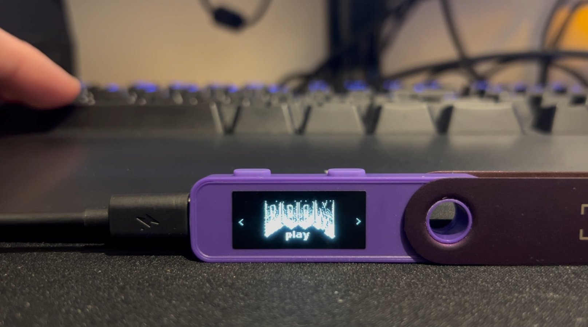

# Doom Ledger Application


This is a port of [Doom-Nano](https://github.com/daveruiz/doom-nano), a Doom-like game made for Arduino. This application is designed for Nanos+ devices only (for now). This port is still in the early stages and might be improved in the near future.

Demo video:

[](https://www.youtube.com/watch?v=9CuAZaa40O8)


## Quick Start Guide

To play on your Nanos+, you will have to follow the developer guide to set up VSCode, clone this repository, and use Ledger's VSCode Developer Tools extension to load the app onto your device.

BE AWARE THAT INSTALLING THIS APP WILL RESET YOUR DEVICE. MAKE SURE YOU HAVE YOUR 24-WORDS RECOVERY PHRASE TO RESTORE YOUR DEVICE LATER. DO NOT INSTALL THIS APP IF YOU ARE NOT WILLING TO TAKE THE RISK.

### Setup VScode, load the app and device configuration

The [Ledger Developper Guide](https://developers.ledger.com/docs/device-app/beginner/vscode-extension) will help you set up your environment to build and load the app onto your device. Watch the videos carefully and ensure your device is updated to the latest version. Only NanoS+ Release app is supported.

Thanks to the Ledger documentation, you're close to playing on your Ledger. Now, you need to configure your device to disable the PIN lock and screen saver. This will prevent the device from sleeping while playing. To do so, follow this [article](https://www.google.com/url?sa=t&source=web&rct=j&opi=89978449&url=https://support.ledger.com/article/360019255553-zd&ved=2ahUKEwiasoG-nYKLAxVOVqQEHQbeH-QQFnoECBMQAw&usg=AOvVaw0huhHS3Y3hjjRjRGpnP0yo) from Ledger Support.


### CAN I START SHOOTING CRYPTO IMPS ? 

Almost! You need to install the requirements to start the pygame client (only tested on Linux). This client will communicate with your device to send inputs to the game. In the root folder of this project, run the following steps:

```bash
python3 -m venv tools/clients/doom
source tools/clients/doom/bin/activate
pip install -r tools/clients/requirements.txt
```

For Linux users, you need to grant udev some [permissions](https://github.com/LedgerHQ/blue-loader-python?tab=readme-ov-file#giving-permissions-on-udev) and then activate them with the following commands:
```bash
sudo udevadm control --reload-rules
sudo udevadm trigger
```

You're all set up. Now, just launch the client:
```bash
source tools/clients/doom/bin/activate
python3 tools/clients/doom_ledger_client.py
```
A pygame window will pop up. Click inside the window, launch the Doom app on your device, and play!

### Controls

The default controls provided with the Python client script are:

- *Arrows* to move
- *Space bar* to shoot
- *Q* to quit/pause the game
- *Return* to start/resume the game

## Developper

If you want to improve the game, correct an issue, or create your own version, all you need is to set up VSCode, and then you’re good to go. There is also a Python client script available to help you test the game with the [Speculos](https://github.com/LedgerHQ/speculos) emulator.

This application does not have unit tests or tests made with the Ragger. I know this is not ideal; my apologies.

## Thanks

Thanks to the existing project [Doom-Nano](https://github.com/daveruiz/doom-nano) for providing a 3D raycasting engine that perfectly matches the SecureElement spec. Thanks to the Ledger team for providing excellent tools that make it easier.
